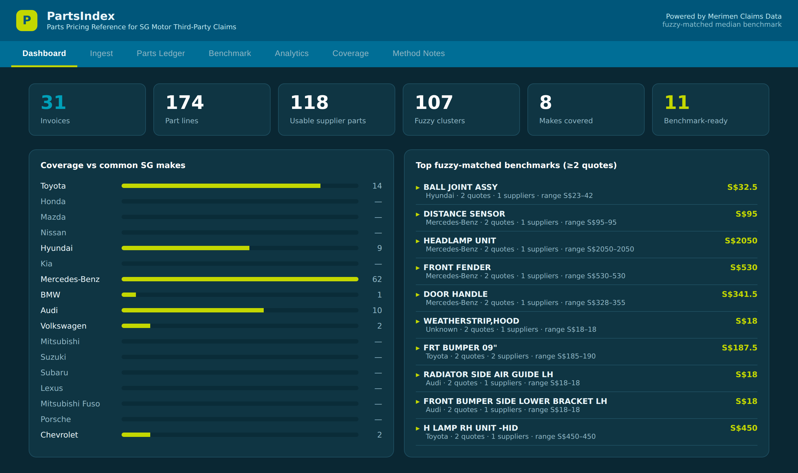

# PartsIndex

**A parts-pricing reference for Singapore motor third-party (TP) claims.**
It mines motor **supplier bills** to build a credible **median benchmark** per
part, so insurers can review repairer estimates against an independent reference,
negotiate fairer offers, expedite fair claims and support disputes.

Built for the Merimen Motor Claims initiative. Branded in the Merimen / Fermion
palette (petrol-teal + lime). Ships with a **demo dataset of 18 real supplier
bills** (174 part lines) so you can explore it immediately.



---

## What it does

- **Ingest two ways** — bulk-upload Claude-OCR'd spreadsheets, or upload raw invoice PDFs/images and have Claude OCR them live.
- **Auto-enrich** — normalises part numbers, infers make/model, assigns a canonical category, and classifies each line (supplier part / consumable / estimate / labour).
- **Fuzzy-matched benchmark** — groups parts by **configurable fuzzy name matching** (not brittle exact part numbers), then computes median / average / range / quote count / suppliers per cluster.
- **Eight live analytics** — median benchmark, inflation flagging, confidence scoring, supplier dispersion, price trend, cross-source agreement, accuracy validation, and a normalisation view. All selectable under the **Analytics** tab.
- **Quote drill-down** — click any benchmark part (on the Dashboard, Benchmark or Analytics tabs) to expand the individual quotes behind it (part number · supplier · price · date).
- **Coverage report** — by make and category, against the project's success criteria.
- **Loads on open + persists** — the 18-bill demo dataset loads automatically on first visit; uploads persist to the browser and reload next session; export the enriched DB + benchmark to `.xlsx`.

### Why fuzzy matching?

Exact part numbers almost never repeat across a small set of bills, so they yield
**no** benchmarks. Fuzzy **name** matching (token overlap + edit distance,
configurable on the **Benchmark** tab) clusters the same part written differently
— e.g. `HEAD LAMP RH` with `HEADLAMP ASSY, RH` — which is what produces usable
multi-quote medians. You control the similarity threshold, the token-vs-spelling
weight, whether to match only within the same make, and can fall back to exact
part-number or category grouping.

---

## Quick start (local)

```bash
npm install
npm run dev        # http://localhost:5173
```

Open the app — the **18-bill demo dataset loads automatically** on first run, so
the dashboard, benchmark and analytics are populated immediately. `npm run build`
produces a static site in `dist/`.

> **Live OCR note.** The Excel-upload path, enrichment, benchmark, analytics and
> export all run **fully in the browser** — no server needed. The **"OCR
> invoices"** button calls Claude and must go through the included serverless
> proxy (`api/ocr.js`) so the API key stays server-side. Locally it will only
> work if you run on a platform that serves that function (e.g. `vercel dev`).

---

## Deploy

### Option A — Vercel (recommended: supports live OCR)

1. Push this repo to GitHub.
2. On [vercel.com](https://vercel.com) → **New Project** → import the repo.
   The **Vite** preset is auto-detected (`vercel.json` is included).
3. To enable the OCR button, add an environment variable
   **`ANTHROPIC_API_KEY`** in **Settings → Environment Variables**. The proxy in
   `api/ocr.js` reads it; the key is never shipped to the browser.
4. Deploy. Every `git push` redeploys automatically.

The site is served at the domain root, so `base` stays `/` (default). Netlify
works the same way — move `api/ocr.js` to `netlify/functions/ocr.js`.

### Option B — GitHub Pages (static; Excel-upload only)

Pages can't run the serverless function, so the OCR button won't work there — the
Excel-upload path still does. Two ways:

**Automatic (CI):** the included workflow `.github/workflows/deploy-pages.yml`
builds on every push to `main` and sets the base path to your repo name. In the
repo → **Settings → Pages**, set **Source: GitHub Actions**. Done.

**Manual:**

```bash
npm run deploy     # builds with VITE_BASE=/partsindex/ and pushes to gh-pages
```

Then **Settings → Pages → Source: `gh-pages` branch**. If your repo isn't named
`partsindex`, edit the `deploy` script's `VITE_BASE=/<your-repo>/`.

---

## Using the app

| Tab | What it does |
|---|---|
| **Dashboard** | KPI tiles, make-coverage bars, top fuzzy-matched benchmarks — **click a part to expand its quotes** |
| **Ingest** | Excel upload, live OCR, reload-demo, export, clear, activity log |
| **Parts Ledger** | Every enriched line; search + filter by make / line-type |
| **Benchmark** | The matching configuration + fuzzy-clustered median table (click a row to see the grouped quotes) |
| **Analytics** | All 8 methods, selectable — the median-benchmark view is also click-to-expand |
| **Coverage** | Make & category coverage vs the success criteria |
| **Method Notes** | What each analytic computes and why |

The **18-bill demo loads automatically** on first visit. Uploaded data persists
and is shown on return; an explicit **Clear dataset** stays cleared across
reloads (it won't re-seed the demo).

### Ingesting the real invoices

- **Spreadsheets:** Ingest → *Bulk upload*. Columns are matched flexibly
  (Part Name, Part No, Qty, Unit, Total, Supplier, Make, Model, Bill No, Date).
- **Raw invoices:** Ingest → *OCR invoices* (needs the Vercel proxy + key).
- The recommended OCR prompt for producing import-ready output is in
  [`OCR_PROMPT.md`](./OCR_PROMPT.md).

---

## Data model & persistence

Each stored line:

```json
{
  "supplier": "Min Ghee Auto Pte Ltd", "bill_no": "8122844", "bill_date": "04/10/2018",
  "make": "Mercedes-Benz", "model": "E-Class (W213)",
  "part_name": "HEADLAMP UNIT", "part_number": "MBA213 906 67 01", "npn": "MBA2139066701",
  "cat": "Headlamp", "qty": 1, "unit": 2050.0, "total": 2050.0,
  "ltype": "Supplier Part", "doc_type": "Tax Invoice"
}
```

**This app** persists to the browser's `localStorage`. **For a productised,
multi-user service, use SQLite** — a single-file DB is genuinely self-sustaining
at this scale (no server to administer, trivial backups) and supports every query
here (GROUP BY, window-function medians, trend-by-date). Suggested schema:

```sql
CREATE TABLE suppliers  (id INTEGER PRIMARY KEY, name TEXT, coy_id TEXT, gst TEXT);
CREATE TABLE invoices   (id INTEGER PRIMARY KEY, bill_no TEXT, bill_date TEXT,
                         supplier_id INT, repairer TEXT, vehicle TEXT, chassis TEXT,
                         make TEXT, model TEXT, doc_type TEXT);
CREATE TABLE part_lines (id INTEGER PRIMARY KEY, invoice_id INT, part_name TEXT,
                         part_number TEXT, npn TEXT, category TEXT, qty REAL,
                         unit REAL, total REAL, line_type TEXT);
```

Move to **Postgres** only when many insurers write concurrently or you need
role-based multi-tenant access. Rule of thumb: **localStorage now → SQLite for
the productised site → Postgres for multi-tenant concurrency.**

---

## Project structure

```
partsindex/
├─ README.md                      ← this file
├─ MANUAL.md                      ← full manual + project journey
├─ OCR_PROMPT.md                  ← tuned prompt for OCR-ing the 200 invoices
├─ index.html
├─ vite.config.js                 ← base path via VITE_BASE
├─ vercel.json
├─ package.json
├─ api/
│  └─ ocr.js                      ← serverless OCR proxy (keeps API key server-side)
├─ .github/workflows/
│  └─ deploy-pages.yml            ← CI deploy to GitHub Pages
├─ public/
│  └─ screenshot.png             ← dashboard preview used in this README
└─ src/
   ├─ main.jsx
   ├─ index.css
   └─ PartsIndex.jsx              ← the whole app: pipeline + fuzzy matcher + UI + embedded demo
```

---

## Limitations

- **Sample size.** Benchmarks firm up only as the same part recurs across bills; the demo's 18 bills are illustrative, the incoming **200** are what make it real.
- **Accuracy (POC#2).** Quantifying TP inflation in dollars needs **matched triples** per claim (supplier-bill cost + repairer estimate + insurer final offer). The app ships the framework; feed it matched claim data to get hard numbers.
- **Live OCR** requires the serverless proxy; never embed an API key in the static bundle. Large multi-page bills may need chunking due to output token limits.

See **[`MANUAL.md`](./MANUAL.md)** for the full manual and the step-by-step
project history.
