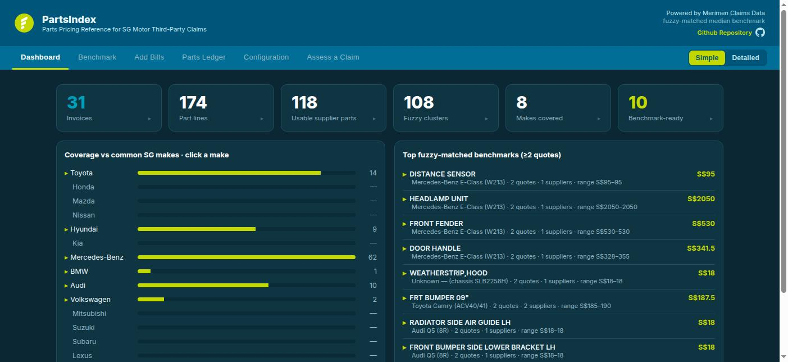

# PartsIndex

**A parts-pricing reference for Singapore motor third-party (TP) claims.**
It mines motor **supplier bills** to build a credible **median benchmark** per
part, so insurers can review repairer estimates against an independent reference,
negotiate fairer offers, expedite fair claims and support disputes.

Built for the Merimen Motor Claims initiative. Branded in the Merimen / Fermion
palette (petrol-teal + lime). Ships with a **demo dataset of 18 real supplier
bills** (174 part lines) so you can explore it immediately.

Repository: <https://github.com/merimenjason/mm-parts-index> — also linked
(text + GitHub icon) from the top-right of the app masthead, under
*fuzzy-matched median benchmark*.



The app opens in **Simple mode** — a Simple/Detailed toggle in the tab bar
hides Analytics, Coverage and Method Notes until a **Detailed** click is
needed, so a first-time reviewer isn't handed the full statistical toolkit
up front.

---

## What it does

- **Ingest two ways** — bulk-upload Claude-OCR'd spreadsheets, or upload raw invoice PDFs/images and have Claude OCR them live.
- **Auto-enrich** — normalises part numbers, infers make/model, assigns a canonical category, and classifies each line (supplier part / consumable / estimate / labour).
- **Fuzzy-matched benchmark** — groups parts by **configurable fuzzy name matching** (not brittle exact part numbers), then computes median / average / range / quote count / suppliers per cluster.
- **Hybrid part-number-first matching** — the benchmark groups by exact (normalised) **part number** first — the identifier supplier bills carry that PeerIndex/eSource lack — then can optionally *bridge* different part numbers whose names are similar within the same make/model (OEM vs aftermarket). Same-model separation stops a Camry headlamp merging with a Hilux one, and a **Basis** column marks whether each benchmark rests on one part number (PN) or a looser name bridge (≈). Configurable on the Configuration tab (bridging is off by default for the most defensible number).
- **Assess a Claim** — paste an incoming repairer estimate (part no · description · quoted price per line), or **upload the estimate document** (PDF / image) and let Claude read it via OCR. A model indicator beside the upload button shows which Claude model will be used (set on the Add Bills tab). Each line is matched to the benchmark, producing a line-by-line variance report against the benchmark, with total quoted vs benchmark, **potential over-claim**, and flagged lines. This is the inverse of building the reference — it puts the reference to work on a live claim.
- **Detailed report export** — the **Export Detailed Report** button turns an assessment into the attachable audit trail (a "dispute pack" internally): an Excel with a **Summary** (claim ref, matching settings, totals, a **benchmark snapshot id**), the **Line Assessment**, and an **Evidence** sheet listing *every underlying supplier quote* behind every benchmark used (make · model · supplier · bill no · date · grade · price · source). Same snapshot id = same data + same settings, so a figure quoted in a negotiation stays reproducible after new bills shift the median.
- **Claim History** — the **Save to claim history** button keeps a completed assessment (the full line-by-line result, its matching-config snapshot, and, when an OCR read of the estimate found them, the workshop name / vehicle plate / make / model) so it can be reopened or re-exported later without re-pasting the estimate. Reachable via the **Claim history (N)** button, which opens a modal listing every saved claim newest-first; each expands to the same result table and can be re-exported or deleted. Persists to `localStorage` by default, or the shared Turso DB via `/api/claims` when the backend is on — same switch as the dataset and activity log (see **Persistence**, below).
- **Benchmark lookup tab + worklist** — a stakeholder-facing benchmark search: filter by make/model, part name or part number (normalisation-aware, so `52119` finds `T52119-06971`), or a global search across all fields, and read each part's **median** and **mean** unit price. Every result drills down to the underlying supplier quotes with full provenance (supplier, bill number, date, grade, and Claude-OCR vs Excel source). Add results to a **Worklist** with the `+` button and export the shortlist to **Excel** (worklist + evidence sheets) or **PDF** (a benchmark table plus an evidence table of the quotes behind each part); worklist rows are expandable to their source quotes, and both exports include that evidence. The PDF library loads on demand so it never bloats the main bundle.
- **Make _and_ model everywhere** — the vehicle **model** is shown alongside make across every tab (Configuration, Parts Ledger, Benchmark, Analytics, Dashboard), in every drill-down, and in both the Excel export and the detailed report. Clusters that legitimately span models carry a `+N` marker with a hover listing them, so the median is never quietly attributed to a single model.
- **Eight live analytics** — median benchmark, inflation flagging, confidence scoring, supplier dispersion, price trend, cross-source agreement, accuracy validation, and a normalisation view. All selectable under the **Analytics** tab (Detailed mode).
- **Dispersion measures (IQR / SD / CV)** — every benchmark carries the interquartile range (Q1–Q3), sample standard deviation and coefficient of variation. The Configuration tab shows an **IQR band** column (a `*` marks clusters below the reliability floor, where spread is advisory); the dispersion and confidence analytics surface SD and CV; and **Assess a Claim** flags any estimate line above the **Tukey upper fence** (Q3 + 1.5·IQR) as `ABOVE BOUND` — a statistically defensible outlier, harder to dispute than a bare percentage. A **Min quotes for reliable spread** slider (range 1–30, default 4, on both the Configuration and Benchmark tabs, writing the shared `cfg.minQuotes`) sets that floor and, since it changes which lines are flagged, is folded into the reproducibility snapshot. Quantiles use Excel's PERCENTILE.INC and SD uses STDEV.S (n−1) so every figure reconciles against a spreadsheet.
- **Quote drill-down everywhere** — click any benchmark part (Dashboard, Configuration tab) and **any row in any of the eight Analytics views** to expand the evidence behind the number: inflation flags open the offending bill plus the full cluster, confidence scores open a component-by-component breakdown (depth / diversity / recency bars), dispersion opens the cheapest-vs-dearest gap with a grade caution, trend strips list their lines in date order, agreement rows show the verdict arithmetic, accuracy signals expand to line-level list-vs-net and per-bill provenance, and normalisation rows reveal every raw spelling that was merged. The same applies outside Analytics: **Parts Ledger** lines open their full record (GST, grade, basis, normalised PN, source, bill context) plus the benchmark they feed; **Assess a Claim** rows open the match evidence — or, for unmatched lines, the closest rejected candidate and why it fell short; **Coverage** makes/categories and the Dashboard coverage bars expand into their part lines.
- **KPI drill-down (two levels)** — click any dashboard KPI tile (Invoices, Part lines, Usable parts, Fuzzy clusters, Makes covered, Benchmark-ready) to open an inline breakdown, then **click any row in that panel** to expand the individual part lines behind it (invoice → its parts, category → its parts, make → its parts, cluster band → its clusters).
- **Coverage report** — by make and category, against the project's success criteria, against the 20 common SG makes (Toyota through newer entrants like BYD, Tesla and MG). A **Grade mix by make** stacked-bar chart (OEM Genuine / OES / Aftermarket / Used-Recon / Unknown per make) lets a reviewer spot at a glance when a make's benchmark rests on one grade of quote versus several.
- **Sortable tables everywhere** — every data table sorts on any column: click a header to order **A→Z**, click again for **Z→A** (▲/▼ marks the active column). Money and percentages sort as numbers, text alphabetically. Covers the Parts Ledger, Configuration, Benchmark results + worklist, Assess-a-Claim results, all eight Analytics views and every Dashboard KPI drill-down. Sorting collapses any open drill-down so the evidence always matches the row above it.
- **Persistent, drill-downable activity log** — the Add Bills tab's *Activity* panel records every ingest, OCR, review and dataset action as a structured event with a **date-and-time stamp**, kind, status and affected-line count, and **persists it** (localStorage by default, or the shared Turso DB via `/api/activity` when the backend is on) so the history survives reloads. Click any entry to drill into its detail — for OCR that includes the **Claude model used** and the **totals-reconciliation** outcome; for imports the suppliers/makes/bills touched — and filter the stream by kind.
- **Duplicate-line detection** — a line item repeated within the same invoice (same part number, qty and price) holds the bill for review instead of silently double-counting that quote in the benchmark. Shared logic between the app and the batch OCR runner.
- **Test-mode OCR** — a "Test mode" toggle on the OCR-invoices card reads and previews an invoice without writing it to the dataset, so trying the OCR path on a demo or sample bill can never skew the live benchmark.
- **Loads on open + persists** — in the browser-only build the 18-bill demo dataset loads automatically on first visit and uploads persist to the browser for next session; with the shared Turso backend the app starts empty and reads/writes one shared dataset. Export the enriched DB + benchmark to `.xlsx` either way.

### How matching works

The **default** mode is **fuzzy part name** — it clusters parts whose names are
similar (token overlap + edit distance), which is what forms usable multi-quote
medians on a small dataset. For a more conservative, court-defensible basis, the
**Hybrid** mode groups by exact normalised **part number** first — the identifier
supplier bills carry that PeerIndex and eSource lack — and only merges *different*
part numbers by name when you turn **bridging** on. Keeping **Same model** on
prevents a Camry headlamp merging with a Hilux one, and every benchmark shows a
**Basis** flag: `PN` (rests on one part number) or `≈` (a name bridge). All four
modes — fuzzy name, hybrid, exact part number, and category — are selectable on
the Configuration tab, along with similarity threshold, token-vs-spelling weight, and
same-make/same-model constraints. As real volume builds and identical part
numbers recur, prefer Hybrid.

The selected mode governs **both** halves of the job: how supplier lines are
clustered into the reference, and how an incoming claim line is matched against
it. **Exact part no only** therefore reports *no match* for a line with no part
number rather than falling back to a name guess, and the **Matched via** column
reflects the mode actually in force (`part number`, `name`, `category`, or
`no match`).

A **benchmark recency window** (All dates by default, or the last 2 / 3 / 5 /
10 years) keeps an old price out of a current median. Bills with no printed date
are always kept — an undated bill is not *known* to be old. The window is part
of the reproducibility snapshot, so it is hashed into the snapshot id and
recorded in the detailed report.

Categorisation runs **component rules before assembly rules**. SG bills name a
small part by what it is and then where it goes, in either order — `Clip, FR
Bumper` and `FRT BUMPER GRILLE LH` — so matching the assembly first pooled a
S$2 clip, a S$55 grille and a S$600 bumper face into one "Front Bumper" median.
Because `cat` is purely derived from the part name, improving a rule reaches the
parts already stored on the next load, with no re-import.

---

### Data quality & validation

- **Grade, GST & unit-basis fields** — every line carries a parts **grade**
  (`OEM Genuine` / `OES` / `Aftermarket` / `Used/Recon` / `Unknown`), a **unit basis**
  (`each` / `pair` / `set`) and the invoice's **GST treatment**. Grade is the single
  largest legitimate price driver: the matcher **refuses to merge an OEM-genuine
  quote with an aftermarket one** (togglable via *Separate grades* on the Configuration
  tab; Unknown grades never block a merge), per-pair prices never join per-each
  medians, and a **positional veto** (v1.12.0) blocks merges across conflicting
  positions at any threshold — front vs rear, upper vs lower, inner vs outer
  always; LH vs RH only when *Separate LH / RH* is ticked (off by default: side
  counterparts are price-identical and pool). Grades come from OCR/Excel when
  supplied, else are inferred from name tags like `(ORIGINAL)`, `(TW)`, `RECON`
  — never guessed.
- **Make canonicalisation** — makes are folded onto a canonical spelling at ingest
  and on load (`canonMake` in `src/pipeline.js`): case- and punctuation-insensitive,
  with aliases (Mercedes / Merc / Benz / MB → **Mercedes-Benz**, VW → Volkswagen,
  Chevy → Chevrolet, …), so the Dashboard and Coverage — which match on the exact
  make string — never split `Mercedes` from `Mercedes-Benz`. `Mitsubishi` and
  `Mitsubishi Fuso` stay distinct; an unrecognised make is left untouched.
- **Totals-reconciliation gate** — every OCR'd invoice's extracted line sum is
  checked against the invoice's own printed parts subtotal (tolerance S$1 or 0.5%).
  Mismatched bills are **held for review and excluded from all benchmarks** until
  accepted or discarded in the Add Bills tab's review queue. Duplicate bills
  (same supplier + bill no) are skipped at upload so quotes never double-count.
- **Duplicate-line gate** — a line repeated *within* one invoice (same normalised
  part number, qty and unit price) holds the whole bill for review alongside the
  totals-reconciliation gate, rather than silently letting a double-entry (or a
  genuinely repeated line) double-count that quote. The Add Bills tab's review
  queue shows a category breakdown (totals mismatch vs duplicate line) of why
  bills are held. `findDuplicateLines` in `src/pipeline.js` is shared by the app
  and the batch OCR runner.
- **Test-mode OCR** — a "Test mode — OCR only, don't save to the dataset" toggle
  on the OCR-invoices card runs the read and the reconciliation/duplicate checks
  but skips the write, so a demo or trial invoice can never accidentally end up
  inside the live benchmark.
- **Gold-standard matcher evaluation** — `npm run eval:pairs` generates candidate
  part pairs for human labeling; `npm run eval:score` replays the *exact* production
  matcher over the labeled set and reports precision/recall/F1 across the full
  threshold grid, including the highest-recall setting that keeps false merges
  under 5% ("dispute-grade"). See [`eval/README.md`](eval/README.md) — the worked
  example surfaced a positional-stopword false merge (fixed in v1.12.0 by the
  veto, which `eval:score` now replays) and threshold headroom (open, P2).
- **Robust, Excel-consistent dispersion** — spread is reported as **IQR** (Q1–Q3),
  sample **SD** and **CV**, chosen because parts pricing is right-skewed (IQR/median
  resist inflated quotes better than mean/SD) and CV makes spread comparable across
  cheap and expensive parts. Quantiles follow `PERCENTILE.INC` (R-7) and SD follows
  `STDEV.S` (n−1) so figures reconcile against a stakeholder's spreadsheet. A
  configurable **reliability floor** (default 4 quotes) marks thin clusters advisory
  and withholds the Tukey outlier bound from them; it is hashed into the benchmark
  snapshot id so exported figures stay reproducible after it is retuned.
- **Measured, not assumed** — the claims above are checked against the live
  reference rather than argued from first principles, and some did not survive:
  forcing *Same model* halves coverage without tightening ranges at all, and
  LH/RH counterparts differ by a median of 4.1%, which is why both stay off by
  default. See **[QA.md](QA.md)** for the full data-validity exercise — what
  fraction of the reference can actually price a part, which hypotheses about
  the price spread were tested and rejected, and the open risks (notably
  pair-vs-single, which the data gives no way to detect). It is also explicit
  about what it does **not** measure: cluster *correctness* is still unverified,
  because `eval/gold_pairs.csv` has 0 of 138 pairs labelled — so the shipped
  `threshold: 0.65` remains uncalibrated.

---

## Quick start (local)

```bash
npm install
npm run dev        # http://localhost:5173
```

Open the app — in the default browser-only build the **18-bill demo dataset
loads automatically on the very first run only**, so the dashboard, benchmark and
analytics are populated immediately. This is logged as a distinct **Auto-seed**
event (not a "Load demo"), and it happens **exactly once**: once this browser has
held any data — a successful import/OCR save, or that first seed — it is never
auto-seeded again (v1.12.1). If the dataset is later cleared or the store is
lost, the app re-opens **empty** rather than resurrecting the demo; use the
**Load demo** button to bring it back deliberately. (With the shared Turso
backend enabled the app starts **empty** from the start — see
[Data model & persistence](#data-model--persistence).) `npm run build` produces a
static site in `dist/`.

> **Live OCR note.** The Excel-upload path, enrichment, benchmark, analytics and
> export all run **fully in the browser** — no server needed. The **"OCR
> invoices"** button calls Claude and must go through the included serverless
> proxy (`api/ocr.js`) so the API key stays server-side. Locally it will only
> work if you run on a platform that serves that function (e.g. `vercel dev`).

---

## Deploy

### Option A — Vercel (recommended: supports live OCR)

1. Push this repo to GitHub.
2. On [vercel.com](https://vercel.com) → **New Project** → import the repo.
   The **Vite** preset is auto-detected (`vercel.json` is included).
3. To enable the OCR button, add an environment variable
   **`ANTHROPIC_API_KEY`** in **Settings → Environment Variables**. The proxy in
   `api/ocr.js` reads it; the key is never shipped to the browser. The proxy
   whitelists the four Add-Bills-tab models and caps `max_tokens`; optionally set
   **`OCR_PROXY_TOKEN`** (server) plus **`VITE_OCR_PROXY_TOKEN`** (build) to the
   same value to require a shared-secret header — a drive-by tripwire, not real
   auth (see `.env.example`).
4. Deploy. Every `git push` redeploys automatically.

The site is served at the domain root, so `base` stays `/` (default). Netlify
works the same way — move `api/ocr.js` to `netlify/functions/ocr.js`.

### Option B — GitHub Pages (static; Excel-upload only)

Pages can't run the serverless function, so the OCR button won't work there — the
Excel-upload path still does. Two ways:

**Automatic (CI):** the included workflow `.github/workflows/deploy-pages.yml`
builds on every push to `main` and sets the base path to your repo name. In the
repo → **Settings → Pages**, set **Source: GitHub Actions**. Done.

**Manual:**

```bash
npm run deploy     # builds with VITE_BASE=/partsindex/ and pushes to gh-pages
```

Then **Settings → Pages → Source: `gh-pages` branch**. If your repo isn't named
`partsindex`, edit the `deploy` script's `VITE_BASE=/<your-repo>/`.

---

## Using the app

| Tab | What it does |
|---|---|
| **Dashboard** | KPI tiles (click any tile to drill into it), make-coverage bars, top fuzzy-matched benchmarks — **click a part to expand its quotes** |
| **Benchmark** | Stakeholder-facing benchmark lookup: filter by make/model, part name or number (normalisation-aware), or global search → **median & mean** per part; a **Min quotes for reliable spread** slider (1–30, shared with Configuration) tunes the `*` floor here too; click a row for every source quote (supplier · bill · date · grade · price · OCR/Excel). Add parts to a **Worklist** with the `+` in the **leftmost column** (each worklist row expands to its source quotes) and export it — with evidence — to **Excel** or **PDF** |
| **Add Bills** | Excel upload, live OCR (with a "Test mode" toggle to preview an OCR read without saving it), reload-demo, export, clear, a held-for-review queue with a reason breakdown (totals mismatch / duplicate line), and a **persistent, drill-downable activity log** (timestamped events, click to expand detail, filter by kind) |
| **Parts Ledger** | Every enriched line with Make/Model columns; **sortable** columns; search + filter by make / line-type |
| **Configuration** | Hybrid matching configuration (part-number-first, optional name bridging) + the median table with Make, Model, Basis and **IQR band** columns and a **Min quotes for reliable spread** floor slider (1–30, default 4); click a row to see the grouped quotes |
| **Assess a Claim** | Paste a repairer estimate, or **upload** the estimate PDF/image for Claude OCR → line-by-line variance vs the benchmark, total potential over-claim, % flags, and an **ABOVE BOUND** flag for lines past the Tukey outlier fence; **Export Detailed Report** produces the attachable audit trail; **Save to claim history** keeps the assessment (plus any workshop/plate/make/model OCR found) for later, reopened via the **Claim history** modal |
| **Analytics** *(Detailed mode)* | All 8 methods, selectable — the median-benchmark view is also click-to-expand |
| **Coverage** *(Detailed mode)* | Make & category coverage vs the success criteria; a **Grade mix by make** chart |
| **Method Notes** *(Detailed mode)* | What each analytic computes and why |

A **Simple / Detailed** toggle in the tab bar (top right) switches between a
lean six-tab view (default) and all nine tabs; the choice persists per browser.

In the browser-only build the **18-bill demo loads automatically on the first
visit only**. A `partsindex_seeded_v1` marker is written the first time this
browser holds data (that seed, or any successful import/OCR save); once set, the
demo is **never auto-seeded again**. So an explicit **Clear dataset** stays
cleared across reloads, and — crucially — if the dataset key is ever lost
(cleared/evicted store, or the pre-1.12.0 silent-save-failure) the app re-opens
**empty** instead of quietly resurrecting the demo over your real data (v1.12.1).
Only fully clearing browser storage (marker included) counts as a fresh first
run. With the shared Turso backend (`VITE_DATA_BACKEND=api`) the app instead
**starts empty** —
the demo is never auto-written to the shared database; seed it deliberately with
`npm run db:seed` or the **Load demo** button, and uploads are written to the
libSQL database via `/api/parts`.

### Ingesting the real invoices

- **Bulk (recommended for the 200-invoice run):** the batch runner —
  `npm run ocr:batch -- --in ./invoices` — OCRs a whole folder through the
  Claude API with the app's exact prompt, **validates every response against
  the schema**, runs the totals-reconciliation gate, dedupes on
  supplier + bill number, and emits `PartsIndex_import.xlsx` for the app's
  *Bulk upload* button. Resumable (SHA-256 manifest), retrying, and it
  supports the **Message Batches API** (`--mode batch`) for 50% token cost.
  See [Batch OCR runner](#batch-ocr-runner) below, and
  [`Cost-Estimation.md`](./Cost-Estimation.md) for the full cost model
  (≈ US$3.40 for all 200 on the recommended Sonnet-batch + Opus 5-retry plan,
  or ≈ US$2.55 on Sonnet 5 intro pricing)
  and the step-by-step run instructions.
- **Spreadsheets:** Add Bills → *Bulk upload*. Columns are matched flexibly
  (Part Name, Part No, Qty, Unit, Total, Supplier, Make, Model, Bill No, Date,
  and — from the batch runner — Grade, Unit Basis, GST, Review, Review Reason).
- **Raw invoices, one at a time:** Add Bills → *OCR invoices* (needs the Vercel proxy + key). A **model picker** on the card chooses which Claude model reads the documents (Sonnet 4.6 by default — the tuned baseline; Sonnet 5 as the cheaper newer option on intro pricing to 31 Aug 2026; Haiku for clean prints, Opus 5/Fable 5 for faint fax and handwriting) — the batch runner takes the same choice via `--model`. A **Test mode** toggle on the same card OCRs and previews an invoice without saving it — safe for a demo or trial run.
- The OCR prompts both paths use live in [`src/ocrPrompt.js`](./src/ocrPrompt.js)
  (documented in [`OCR_PROMPT.md`](./OCR_PROMPT.md)) — one source of truth.
  The file contains `OCR_SYS` (supplier bills) and `ESTIMATE_OCR_SYS`
  (repairer estimates for Assess a Claim).

---

## Batch OCR runner

`tools/batch-ocr.mjs` is the pipeline for turning a folder of supplier bills
into an app-ready workbook, built to survive a 200-invoice run:

```bash
export ANTHROPIC_API_KEY=sk-ant-...
npm run ocr:batch -- --in ./invoices --dry-run     # show the plan, no API calls
npm run ocr:batch -- --in ./invoices --limit 5     # trial run on 5 files first
npm run ocr:batch -- --in ./invoices               # live, 2 concurrent calls
npm run ocr:batch -- --in ./invoices --mode batch  # Message Batches API — 50% cost, ≤24 h
```

What it guarantees:

- **Schema validation before ingest** — every response is checked against the
  invoice schema (`validateInvoice` in `src/pipeline.js`); model output drift
  becomes a logged failure, not a corrupted benchmark.
- **Reconciliation gate** — extracted line totals vs the invoice's own printed
  subtotal; mismatches are exported with `Review = yes` and the app holds them
  in the Ingest review queue, out of all benchmarks.
- **Duplicate protection** — same supplier + bill number is never extracted
  twice, across runs.
- **Resume** — `ocr_out/manifest.json` records every file by SHA-256; re-running
  skips completed work, `--retry-failed` re-attempts failures, and pending
  Message Batches are polled to completion after a crash.
- **Audit trail** — one validated JSON per invoice under `ocr_out/json/`, a
  *Run Log* sheet with per-file status/reconciliation/tokens, and
  `run_report.json`. Pass `--price-in/--price-out` ($/MTok — see the
  [pricing docs](https://docs.claude.com/en/docs/about-claude/pricing); use
  batch rates with `--mode batch`) for a cost estimate.

`tools/mock-server.mjs` fakes the API locally so the whole flow can be tested
offline (`node tools/mock-server.mjs`, then run with
`PARTSINDEX_API_BASE=http://127.0.0.1:8787`). `npm run test:tools` runs the
self-test suite over the validation, dedup, manifest, dispute-pack, and
dispersion-statistics (IQR / SD / CV, Tukey fences, reliability floor) logic.

---

## Data model & persistence

Each stored line:

```json
{
  "supplier": "Min Ghee Auto Pte Ltd", "bill_no": "8122844", "bill_date": "04/10/2018",
  "make": "Mercedes-Benz", "model": "E-Class (W213)",
  "part_name": "HEADLAMP UNIT", "part_number": "MBA213 906 67 01", "npn": "MBA2139066701",
  "cat": "Headlamp", "qty": 1, "unit": 2050.0, "total": 2050.0,
  "ltype": "Supplier Part", "doc_type": "Tax Invoice"
}
```

**This app** persists to the browser's `localStorage` by default — zero setup,
per-browser, fine for the POC. **To make the benchmark one _shared_ reference
that every user queries, it now ships an optional server-backed store built on
Turso / libSQL** (SQLite over HTTP). Flip it on with env vars; no component code
changes.

#### Why Turso/libSQL and not a plain SQLite file

A file-based SQLite database **cannot persist writes on Vercel**: serverless
functions have an ephemeral, effectively read-only filesystem (only `/tmp` is
writable, it is wiped between invocations, and concurrent instances don't share
it). libSQL is Turso's SQLite fork exposed **over HTTP** — identical SQL and
schema, but the driver makes lightweight stateless calls to a remote database,
which is exactly what ephemeral serverless wants (no always-on connection pool).
The only difference between local and prod is the connection URL:

```
local dev :  TURSO_DATABASE_URL=file:local.db                  # a real SQLite file
production:  TURSO_DATABASE_URL=libsql://<db>.turso.io + TURSO_AUTH_TOKEN
```

#### How it's wired

The browser never holds the DB token. It calls a same-origin endpoint, exactly
like the OCR proxy:

```
src/datasource.js   loadDataset()/saveDataset() + loadEvents()/appendEvent()
      │              + loadClaims()/saveClaim()/deleteClaim()
      │                — all switch on VITE_DATA_BACKEND
      │  fetch /api/parts  ·  fetch /api/activity  ·  fetch /api/claims
      ▼
api/parts.js        GET → { parts:[…] } ;  POST → replace/append
api/activity.js     GET → { events:[…] } ; POST → append one event
api/claims.js       GET → { claims:[…] }; POST → save one; DELETE → remove one
api/_db.js          libSQL client, schema, upsert/replace + getActivity/appendActivity
                    + getClaims/saveClaim/deleteClaim (server-only, holds the token)
```

The **activity log** rides the same rails as the dataset: `loadEvents()` /
`appendEvent()` in `src/datasource.js` write to `localStorage` by default or the
shared DB via `/api/activity` when `VITE_DATA_BACKEND=api`, so the Add Bills tab's
history is durable and (on the shared backend) shared across users.

The **Assess a Claim tab's Claim History** rides the same rails: `loadClaims()` /
`saveClaim()` / `deleteClaim()` write to `localStorage` by default, or the shared
DB via `/api/claims`. A saved claim carries the full assessed lines (including
match evidence, for re-export) plus any workshop name / vehicle plate / make /
model an OCR read of the estimate found — so on the shared backend, every
reviewer sees the same claim history.

`src/pipeline.js` is untouched — it operates on plain arrays, so it doesn't care
whether the array came from `localStorage` or a `SELECT`. That existing
separation is what makes this a drop-in. Heavy stats (median/IQR/clustering)
**stay in JS on purpose**: pushing them into SQL would quietly change the numbers
(SQLite's quantiles don't match the app's Excel-consistent `PERCENTILE.INC`).

Schema (`api/_db.js` — one row per enriched supplier-part line, the exact object
the app already holds in memory):

```sql
CREATE TABLE parts (
  id TEXT PRIMARY KEY, bill_no TEXT, supplier TEXT, bill_date TEXT,
  make TEXT, model TEXT, part_name TEXT, part_number TEXT, npn TEXT, cat TEXT,
  qty REAL, unit REAL, total REAL, ltype TEXT, doc_type TEXT, src TEXT,
  grade TEXT, unit_basis TEXT, gst TEXT, review INTEGER, review_reason TEXT
);

-- Append-only activity/ingest log. One row per event; the detail column is a
-- JSON blob the Add Bills tab expands for drill-down.
CREATE TABLE activity (
  id TEXT PRIMARY KEY, ts TEXT, kind TEXT, action TEXT, message TEXT,
  source TEXT, count INTEGER, status TEXT, detail TEXT
);

-- Claim History (schema_version 3, added v1.16.0) — one row per saved
-- assessment from Assess a Claim. cfg/rows are JSON blobs: rows carries the
-- full assessed lines including cluster evidence, so a reopened claim
-- renders identically and can still be re-exported.
CREATE TABLE claims (
  id TEXT PRIMARY KEY, saved_at TEXT, claim_ref TEXT, workshop TEXT,
  plate TEXT, make TEXT, model TEXT, snapshot_id TEXT, infl_pct REAL,
  invoices INTEGER, usable_lines INTEGER, app_version TEXT,
  generated_at TEXT, cfg TEXT, rows TEXT
);
```

#### Enabling it

```bash
# 1. create a Turso database (once), grab its URL + token
#    https://turso.tech → create DB → copy the libsql:// URL and an auth token

# 2. set env vars (locally in .env, in prod via the Vercel dashboard)
TURSO_DATABASE_URL=libsql://<db>.turso.io
TURSO_AUTH_TOKEN=<token>
VITE_DATA_BACKEND=api          # tells the frontend to use /api/parts
PARTS_WRITE_TOKEN=<secret>     # gates the destructive replace — see below

# 3. create the schema (and optionally seed the 18-bill demo)
npm run db:init                # schema only
npm run db:seed                # schema + demo dataset

# local dev without Turso at all — a real on-disk SQLite file:
TURSO_DATABASE_URL=file:local.db npm run db:seed
```

### Protecting the shared reference

`POST /api/parts` defaults to `mode:"append"` (upsert by id). The destructive
`mode:"replace"` — which deletes every row before re-inserting — additionally
requires the `PARTS_WRITE_TOKEN` secret in an `x-parts-token` header:

```bash
curl -X POST https://jason.engineering/api/parts \
  -H "content-type: application/json" \
  -H "x-parts-token: $PARTS_WRITE_TOKEN" \
  -d '{"mode":"replace","parts":[...]}'
```

Three properties worth knowing:

- **The check fails closed.** If `PARTS_WRITE_TOKEN` is unset, every replace is
  refused. A missing env var can never silently reopen the endpoint.
- **The token is never in the browser bundle.** Anything shipped to the client
  is readable in devtools, so the app can only append. The practical
  consequence: a line deleted in the browser is *not* deleted from the shared
  reference — pruning is an operator action run with the token.
- **A replace snapshots first.** The previous contents are written to
  `meta` as `snapshot:<iso-timestamp>`, and the five most recent are retained,
  so a bad replace can be undone by hand.

Leaving the vars unset keeps the original browser-only build (GitHub Pages, no
server) working unchanged. Move to **Postgres** (Vercel's Marketplace offers
Neon/Supabase/Prisma Postgres) only when many insurers write concurrently or you
need role-based multi-tenant access. Rule of thumb: **localStorage for a single
user → Turso/libSQL for a shared reference → Postgres for multi-tenant
concurrency.**

---

## Project structure

```
partsindex/
├─ README.md                      ← this file
├─ MANUAL.md                      ← full manual + project journey
├─ HANDOVER.md                    ← onboarding handover for a new developer
├─ Fable.md                       ← feature roadmap (F1–F7, elaborated)
├─ OPUS_PROMPTS.md                ← ready-to-run implementation prompts (P1–P15) + status
├─ OCR_PROMPT.md                  ← tuned prompt for OCR-ing the 200 invoices
├─ Cost-Estimation.md             ← cost model + step-by-step instructions for the 200-invoice ingestion
├─ index.html
├─ vite.config.js                 ← base path via VITE_BASE
├─ vercel.json
├─ package.json
├─ api/
│  ├─ ocr.js                      ← serverless OCR proxy (keeps API key server-side)
│  ├─ parts.js                    ← serverless dataset endpoint (GET/POST → shared DB)
│  ├─ activity.js                 ← serverless activity-log endpoint (GET/POST → shared DB)
│  ├─ claims.js                   ← serverless Claim History endpoint (GET/POST/DELETE → shared DB)
│  └─ _db.js                      ← libSQL/Turso client + schema (parts + activity + claims) + upsert (server-only, holds the token)
├─ .github/workflows/
│  └─ deploy-pages.yml            ← CI deploy to GitHub Pages
├─ public/
│  ├─ favicon.ico / favicon-32.png / favicon-128.png   ← Merimen "f" browser icon
│  ├─ apple-touch-icon.png
│  └─ screenshot.png             ← dashboard preview used in this README
├─ .env.example                   ← documents ANTHROPIC_API_KEY, Turso DB vars, OCR proxy token (set in the host dashboard, never committed)
├─ .gitignore                     ← node_modules, dist, local.db, .env*, Vite timestamp junk, ocr_out
├─ CHANGELOG.md                   ← version history
├─ eval/
│  ├─ README.md                   ← gold-set labeling policy + how to read results
│  ├─ generate_pairs.mjs          ← emits candidate pairs for human labeling
│  ├─ evaluate.mjs                ← precision/recall/F1 sweep over the labeled set
│  ├─ gold_pairs.csv              ← 138 candidate pairs awaiting human labels (y/n/?)
│  ├─ gold_pairs.example_labeled.csv  ← worked example (illustrative labels — not ground truth)
│  └─ results.csv                 ← sweep output from the worked example (re-generate after labeling)
├─ tools/
│  ├─ batch-ocr.mjs               ← bulk OCR runner for the 200-invoice run (resumable, validating)
│  ├─ db-init.mjs                 ← npm run db:init / db:seed — create the libSQL schema, optionally seed the demo
│  ├─ mock-server.mjs             ← local fake of the API for offline testing
│  └─ selftest.mjs                ← npm run test:tools — validation/dedup/manifest/dispute-pack tests
└─ src/
   ├─ main.jsx
   ├─ index.css
   ├─ datasource.js               ← loadDataset/saveDataset + loadEvents/appendEvent + loadClaims/saveClaim/deleteClaim — switch localStorage ↔ /api/parts · /api/activity · /api/claims (VITE_DATA_BACKEND)
   ├─ ocrPrompt.js                ← the tuned OCR prompt — single source of truth (app + runner)
   ├─ pipeline.js                 ← pure enrichment + matcher + validation + dispute pack (shared by app, eval, tools)
   ├─ demoData.js                 ← embedded 174-line demo dataset
   └─ PartsIndex.jsx              ← the React UI
```

---

## Limitations

- **Sample size.** Benchmarks firm up only as the same part recurs across bills; the demo's 18 bills are illustrative, the incoming **200** are what make it real.
- **Accuracy (POC#2).** Quantifying TP inflation in dollars needs **matched triples** per claim (supplier-bill cost + repairer estimate + insurer final offer). The app ships the framework; feed it matched claim data to get hard numbers.
- **Live OCR** requires the serverless proxy; never embed an API key in the static bundle. Large multi-page bills may need chunking due to output token limits.
- **The proxy is unauthenticated.** `api/ocr.js` hides the API key but accepts requests from anyone who knows the URL — no origin check, shared secret, model allowlist or rate limit yet. Fine for a private POC link; harden before the URL circulates.
- **`localStorage` is bounded (~5 MB)** and a failed write only logs to the console today. Export to Excel regularly during large ingests.
- **Matcher calibration is pending.** The gold set (`eval/gold_pairs.csv`, 138 pairs) is generated but unlabeled, so the shipped 0.65 threshold is uncalibrated. The positional false-merge bug is fixed (v1.12.0 veto); marked-vs-unmarked positional pairs remain threshold-dependent by design — see MANUAL.md §9 for the pre-run checklist.

See **[`MANUAL.md`](./MANUAL.md)** for the full manual and the step-by-step
project history, and **[`CHANGELOG.md`](./CHANGELOG.md)** for the version
history. New to the project? Start with **[`HANDOVER.md`](./HANDOVER.md)**.
Planned work: the feature roadmap is **[`Fable.md`](./Fable.md)** and every
item — known fixes and new features alike — has a ready-to-run
implementation prompt in **[`OPUS_PROMPTS.md`](./OPUS_PROMPTS.md)**.
